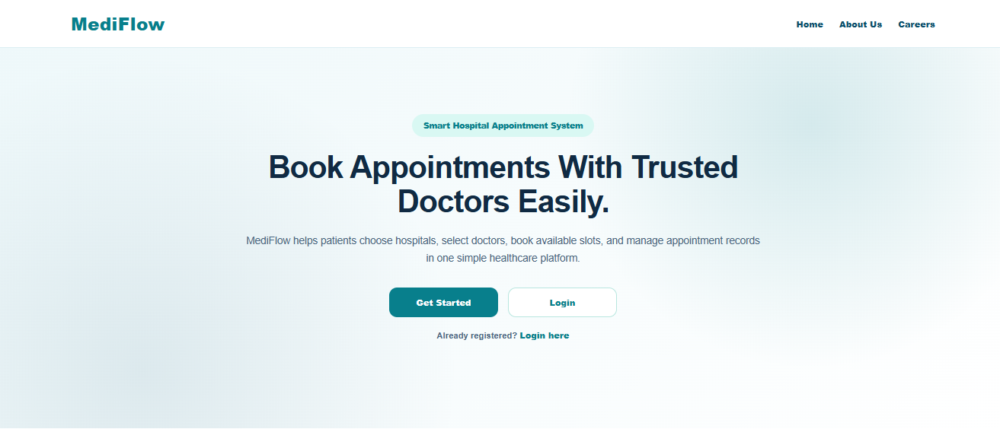
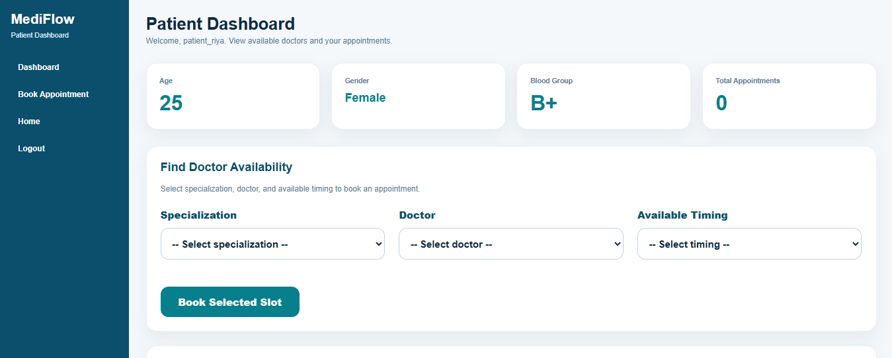
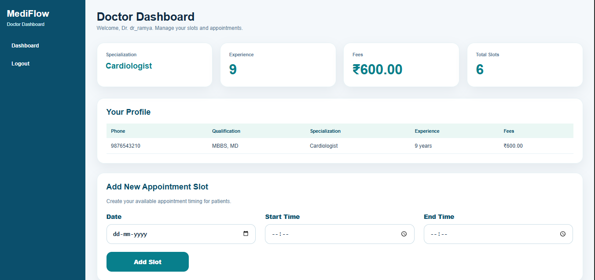
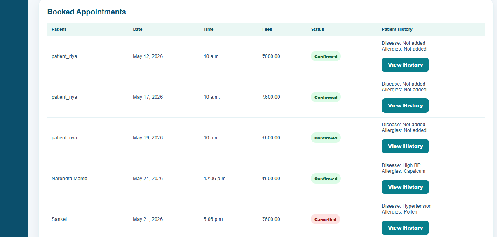
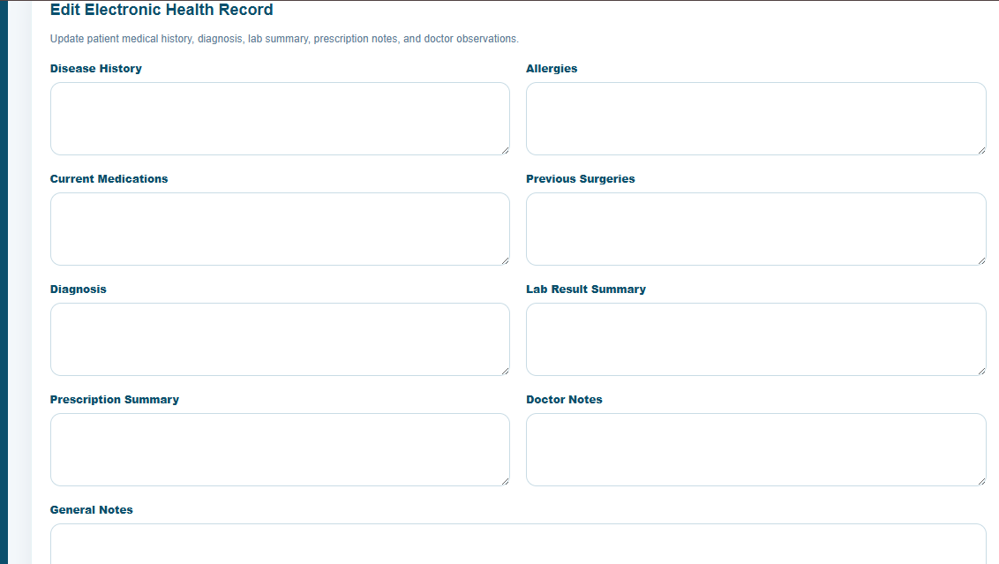
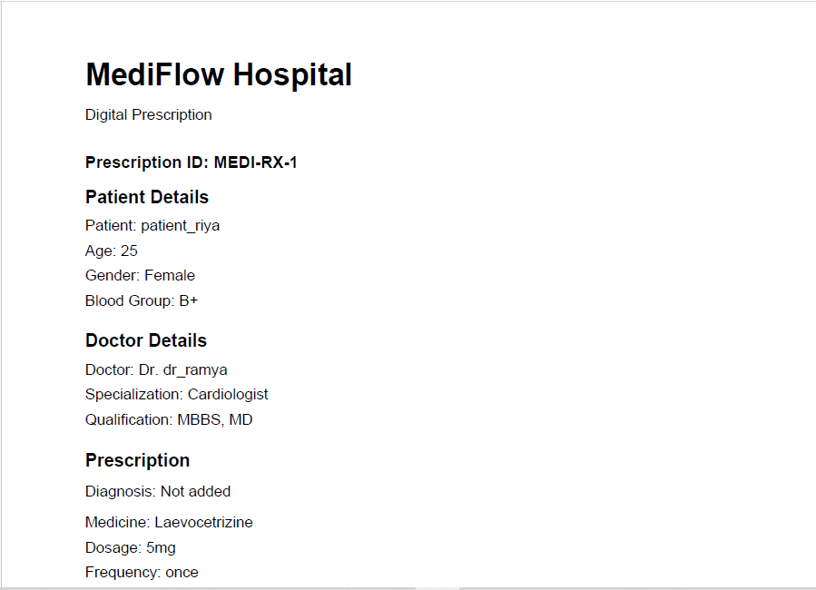

# MediFlow Hospital Management System

MediFlow is a hospital management and appointment booking system. It allows patients to sign up, book appointments, upload medical documents, and access appointment history. Doctors can add appointment slots, view booked appointments, update patient electronic health records, and generate digital prescriptions.

## Features

- Patient signup and login
- Doctor and patient dashboards
- Admin-managed hospitals and doctors
- Doctor appointment slot creation
- Patient appointment booking
- Cancel and reschedule appointment flow
- Electronic Health Records
- Digital prescription creation
- Prescription PDF download
- Medical document vault
- Appointment history

## Tech Stack

- Python
- MySQL
- HTML
- CSS
- JavaScript
- ReportLab

## Setup Instructions

1. Clone the repository:

```bash
git clone https://github.com/Pjay05/MediFlow-Hospital-Management-System.git
cd MediFlow-Hospital-Management-System

2. Create and activate virtual environment:

```bash
python -m venv venv
venv\Scripts\activate

## Screenshots

### Home Page


### Patient Dashboard


### Doctor Dashboard


### Appointment Confirmation


### Electronic Health Record


### Prescription PDF


